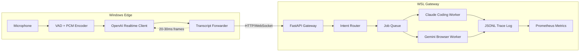

# Dual-Environment Orchestration Platform

This document describes the production-grade dual-environment deployment model for the Big-3 Super Agent. The architecture separates low-latency voice capture (Windows) from heavy orchestration workloads (WSL) while maintaining a single continuous user experience.

## High-Level Architecture



## Execution Flow

1. **Windows Edge** captures 16 kHz PCM audio and applies WebRTC VAD to detect speech activity within 20–30 ms frames.
2. Frames are streamed to the OpenAI Realtime API via WebSocket with `response.create` events issued immediately on detection.
3. Partial transcript deltas are parsed and forwarded asynchronously to the WSL gateway over localhost without blocking microphone capture.
4. **WSL Gateway** receives transcript payloads and, for final segments, creates structured `TaskRequest` objects through the FastAPI `/transcript` endpoint.
5. The **Task Router** matches natural language intent against a registry of skills. It supports fan-out to multiple agents and fan-in through shared trace identifiers.
6. Jobs are enqueued into the pluggable queue abstraction. The default implementation is in-memory but is ready to swap for Redis.
7. Dedicated worker processes execute coding and browser automation tasks, track token usage and cost, and stream JSONL trace events.
8. Observability is unified through Prometheus metrics, JSONL traces convertible into SQLite for Datasette, and per-agent dashboards.

## Environment Separation

| Concern | Windows Edge (`.env.local`) | WSL Gateway (`.env.wsl`) |
| --- | --- | --- |
| Real-time audio | ✔️ Captures mic input, handles VAD, maintains OpenAI session | ❌ |
| Task orchestration | ❌ | ✔️ FastAPI gateway, queue, workers |
| Credentials | `OPENAI_API_KEY` only | `OPENAI_API_KEY`, `ANTHROPIC_API_KEY`, `GEMINI_API_KEY` |
| Observability | Edge telemetry logged locally | Unified JSONL traces, Prometheus metrics |
| Failure handling | Automatic reconnects, non-blocking forwarding | Worker retries via queue |

## Prometheus Metrics

The orchestration layer exposes `/metrics` with counters and histograms:

- `dual_orchestrator_trace_events_total{phase="submitted"}` – submitted jobs
- `dual_orchestrator_trace_write_seconds_bucket` – trace write latency distribution

These metrics can be scraped by Prometheus and visualised with Grafana dashboards per agent.

## Datasette & Trace Browsing

Generate and explore trace data:

```bash
make traces
# Run datasette manually if desired
uv run datasette logs/traces.db
```

Traces include `trace_id`, `job_id`, `phase`, payload metadata, token counts, and cost estimates for each worker execution.

## Example Voice Flow

1. Speak: “Refactor the API and validate the staging website.”
2. Windows edge streams audio to OpenAI Realtime; a partial response returns within ~300 ms.
3. Final transcript is forwarded to the WSL gateway, which emits two jobs (`coding`, `browser`).
4. Claude Code proposes file changes under `apps/content-gen`, while Gemini/Playwright validates the staging URL.
5. Worker outputs are combined via shared `trace_id`, logged in JSONL, and surfaced to the caller or UI.

## Extending the Platform

- Add new skills by dropping JSON definitions in `apps/orchestration/dual_orchestrator/skills/`.
- Implement a Redis-backed queue by subclassing `JobQueue` and updating `OrchestratorSettings.queue.backend`.
- Provide new workers by implementing the `Worker` ABC and wiring them up during FastAPI startup.

## Directory Map

```
apps/orchestration/
├── dual_orchestrator/
│   ├── main.py                # FastAPI gateway
│   ├── config.py              # Environment-aware configuration
│   ├── models/                # Job + task dataclasses
│   ├── queue/                 # Queue abstraction + in-memory impl
│   ├── services/              # Orchestrator + job store + router
│   ├── skills/                # Skill registry + defaults
│   ├── workers/               # Coding + browser workers
│   ├── observability/         # Trace logging + metrics
│   ├── utils/                 # Trace to SQLite tooling
│   └── windows_edge/          # Windows voice capture client
└── tests/                     # Pytest coverage
```

## Setup Overview

1. Configure `.env.local` on Windows with the realtime key and gateway URL.
2. Configure `.env.wsl` on WSL with all service keys and working directories.
3. From WSL, run `make dev` to start the FastAPI gateway and workers.
4. From Windows, run the edge client (`python edge_client.py`) to begin streaming audio.
5. Inspect metrics at `http://localhost:8080/metrics` and job traces via the JSONL log or SQLite export.

## Future Enhancements

- Drop-in Redis queue adapter with visibility timeouts.
- Datasette container for real-time trace browsing.
- UI dashboard summarising latency, cost, and worker throughput.
- Additional agent types (e.g., evaluation, deployment) via registry definitions.
